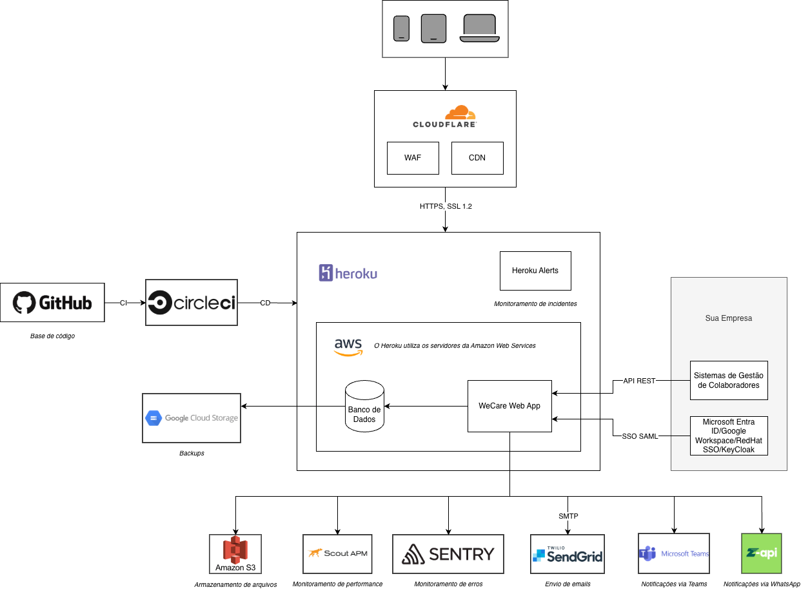

# Arquitetura e Infraestrutura

## Visão Geral

A arquitetura da WeCare foi projetada para garantir segurança, escalabilidade e alta disponibilidade em um modelo SaaS (Software as a Service), atendendo organizações de médio e grande porte.

A plataforma é desenvolvida utilizando tecnologias modernas e consolidadas de mercado, com foco em confiabilidade operacional, facilidade de manutenção e evolução contínua.

Nossa aplicação é estruturada como um sistema web centralizado, com suporte a API REST para integrações externas, permitindo interoperabilidade com sistemas corporativos dos clientes de forma segura e controlada.

---

## Diagrama de Arquitetura

---

## Princípios de Arquitetura

A construção da arquitetura da WeCare segue princípios fundamentais que orientam todas as decisões técnicas:

* **Segurança por design**: 
  A segurança é considerada desde a concepção das funcionalidades, incluindo controle de acesso, proteção de dados e requisitos de auditoria.

* **Escalabilidade**: 
  A infraestrutura é preparada para crescer de forma dinâmica conforme a demanda, garantindo performance consistente mesmo com aumento de carga.

* **Alta disponibilidade**: 
  A plataforma é monitorada continuamente e projetada para minimizar indisponibilidades, com mecanismos de redundância e recuperação.

* **Isolamento de ambientes**: 
  Os ambientes de desenvolvimento, homologação e produção são segregados para reduzir riscos e garantir a integridade dos dados.

* **Integração segura**: 
  Todas as integrações são realizadas por meio de APIs protegidas e mecanismos de autenticação robustos.

---

## Componentes Principais

A arquitetura da WeCare é composta pelos seguintes elementos principais:

* **Aplicação Web**: 
  Interface utilizada por administradores e colaboradores para acesso às funcionalidades da plataforma.

* **API REST**: 
  Camada de integração responsável pela comunicação com sistemas externos, utilizando autenticação segura baseada em tokens.

* **Banco de Dados**: 
  Responsável pelo armazenamento seguro das informações da plataforma, com controles de acesso e políticas de backup.

* **Serviços de Infraestrutura**: 
  Incluem monitoramento, balanceamento de carga, armazenamento e mecanismos de segurança providos por parceiros especializados.

---

## Modelo Operacional

A WeCare opera em um modelo de infraestrutura em nuvem, utilizando provedores consolidados que atendem a padrões internacionais de segurança e conformidade.

Os serviços são monitorados continuamente, com alertas automáticos para identificação de falhas, degradação de performance ou eventos de segurança.

A arquitetura permite evolução contínua da plataforma, com deploys controlados e automatizados, reduzindo riscos operacionais e garantindo maior previsibilidade nas mudanças.

---

## Considerações de Segurança

A arquitetura da WeCare incorpora múltiplas camadas de proteção, incluindo:

* criptografia de dados em trânsito e em repouso
* controle de acesso baseado em perfis e privilégios mínimos
* proteção contra ameaças externas
* monitoramento contínuo de eventos e anomalias

Esses controles são complementados por processos internos de gestão de riscos, gestão de vulnerabilidades e resposta a incidentes.

---

## Evolução Contínua

A arquitetura da plataforma é revisada periodicamente para acompanhar:

* novas ameaças de segurança
* evolução tecnológica
* crescimento da base de clientes
* requisitos regulatórios

Esse processo garante que a WeCare mantenha um ambiente seguro, resiliente e alinhado às melhores práticas do mercado.
